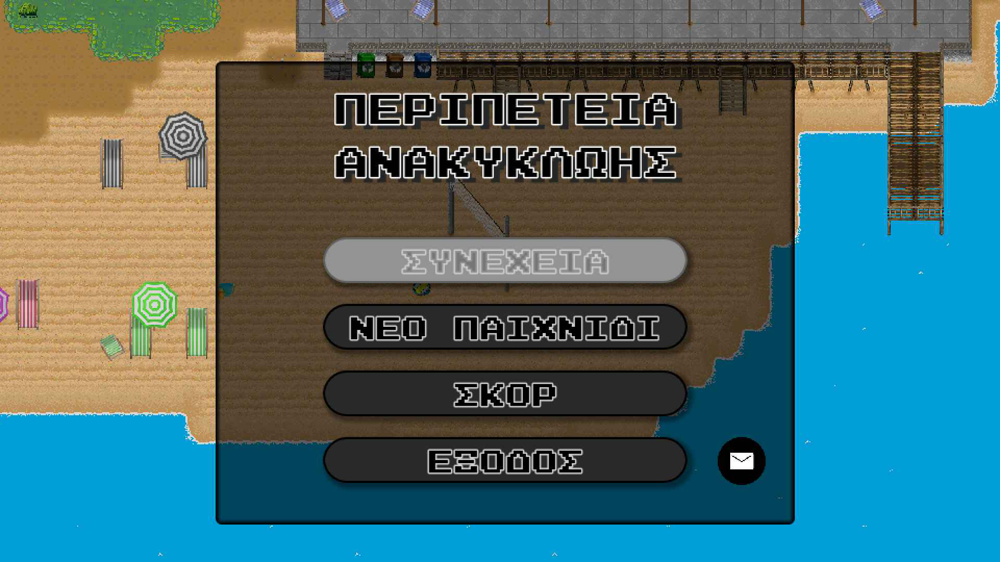
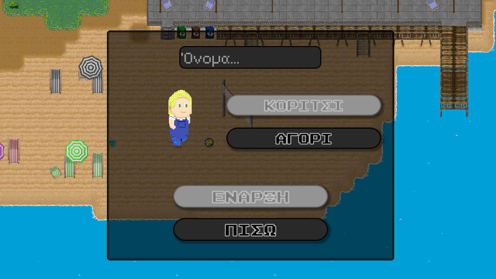
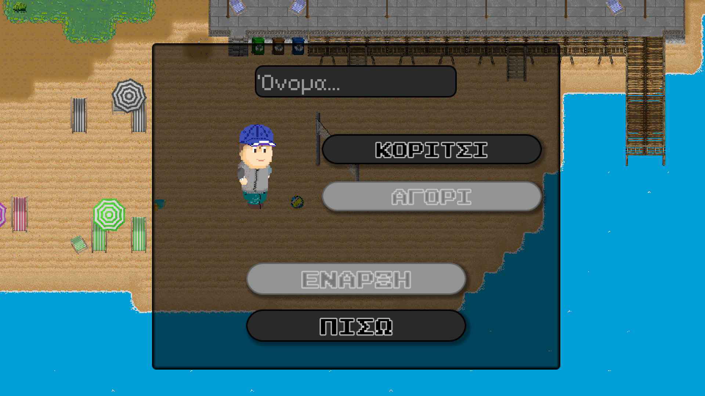
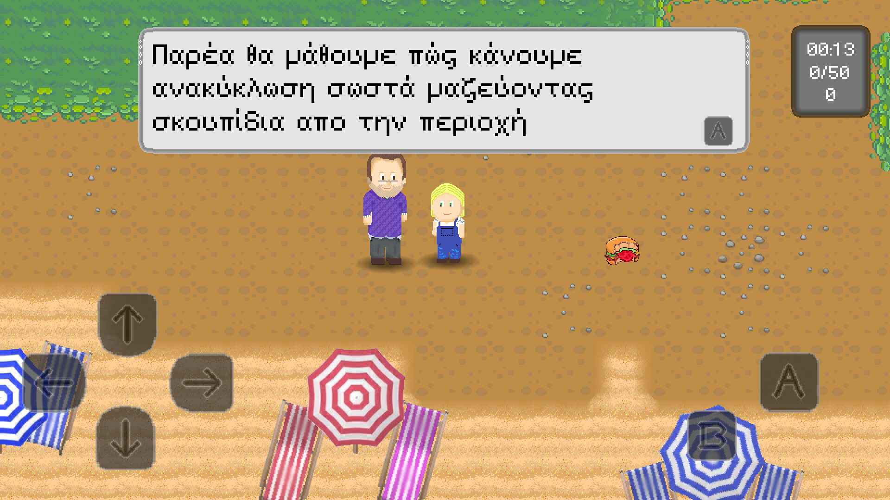
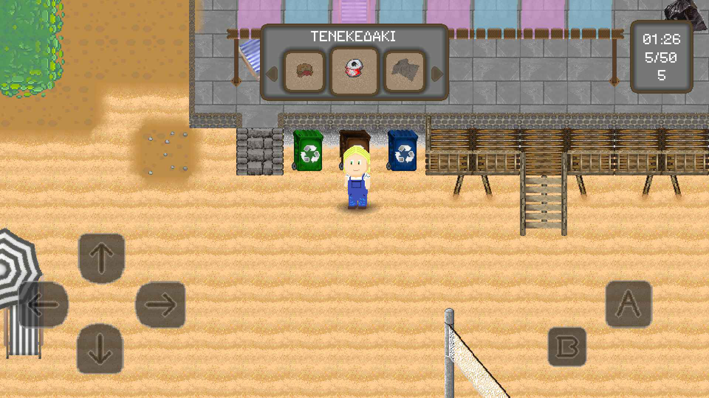
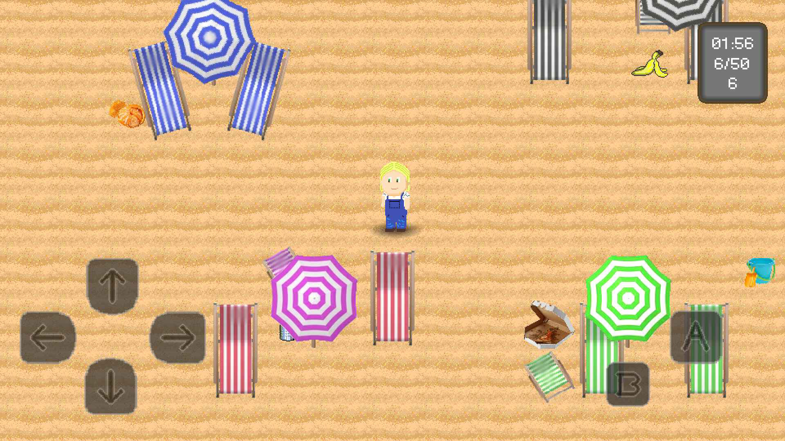
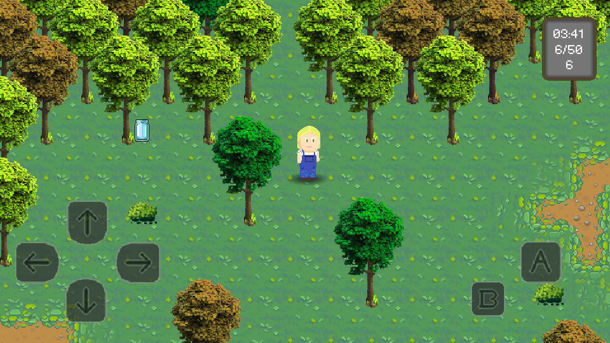
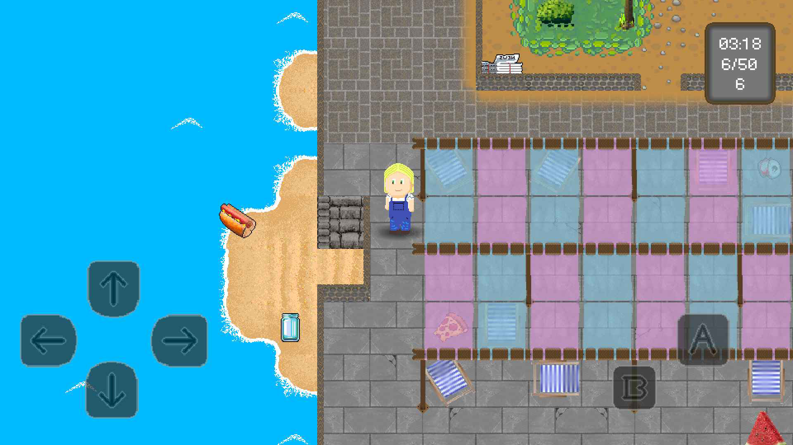

# Recycling Adventure
A mobile(android) game made in GODOT

<!-- TOC -->
* [Recycling Adventure](#recycling-adventure)
  * [GAME DESCRIPTION](#game-description)
    * [Gameplay Highlights](#gameplay-highlights)
    * [AVAILABILITY](#availability)
    * [USEFUL LINKS](#useful-links)
<!-- TOC -->

## GAME DESCRIPTION

Welcome to "Περιπέτεια Ανακύκλωσης (Recycling Adventure)" – a fun, 
educational game that teaches the importance of recycling and 
environmental responsibility!

In this engaging 2D, top-down adventure, players take on the role 
of a young environmental hero dedicated to cleaning up a beach littered 
with trash. As you move along the shoreline, you'll encounter different 
types of waste – plastics, metals, paper, and more – all of which need to 
be sorted into the correct recycling bins.

Age Range: 6+

### Gameplay Highlights
* #### Learn While You Play
  

  Discover the basics of recycling by identifying and sorting different 
  kinds of waste. Players learn which materials belong in which bins, 
  helping reinforce eco-friendly habits.
  

* #### Interactive Environment
  

  Enjoy a colorful, beach side setting where every piece of trash you pick 
  up and recycle correctly helps bring the environment back to life.
  

* #### Eco-Friendly Message
  

  The game promotes environmental awareness and shows how small actions, 
  like recycling, can make a big difference.
  

Designed for kids aged 6 and up, Recycling Adventure is ideal for young 
players looking to learn about sustainability while having a great time.

 
 
 
 
 
 
 
 
 

### AVAILABILITY
* ###### GREECE

### USEFUL LINKS
* ##### [playstore](https://play.google.com/store/apps/details?id=com.leonzch.projectNature)

published 28/11/2024